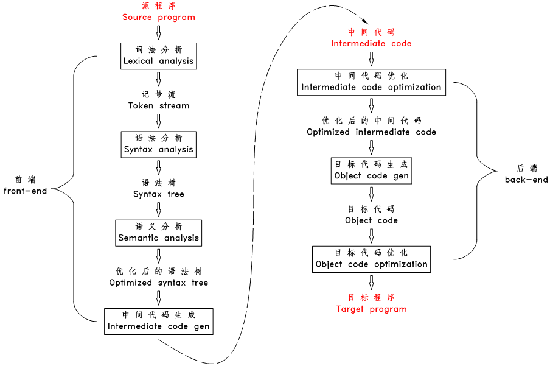
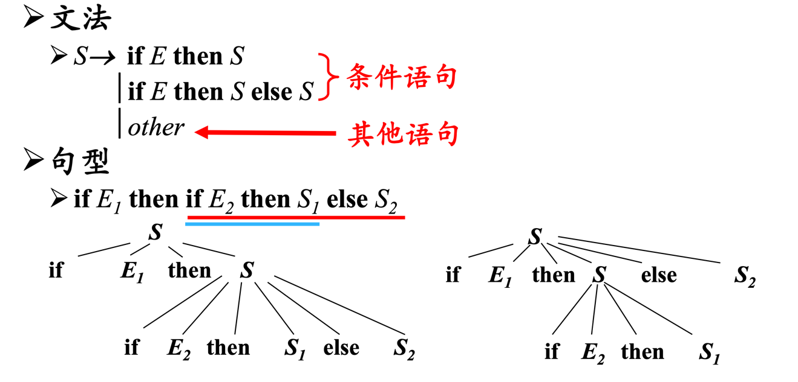

== 编译器

=== 概念

|===

|*概念名称* |*释义*

|*字母表 Σ 和符号*
|字母表就是一个 [underline]#有穷符号的集合#，用 Σ 表示，里面的每个元素称为符号。如： Σ = {0, 1}, Σ = {a, b, ..., z} 。 +
符号：字母、数字、标点符号、...

|*句子(sentence)/串(string)*
|Σ 上的句子就是 [underline]#一串符号#，里面每个符号都属于 Σ ，句子用 s 表示，即 s = θ~1~ θ~2~ ... θ~n~ , θ~i~ ∈ Σ , n ∈ N （此处 N 特指自然数集合），如 abcd、"hello world"、 一个C程序的源代码等都是一个句子。

|*空句子 ε*
|空句子就是没有任何符号的句子，用 ε 表示，空句子也是一个句子，就是上面那个式子中 n = 0 的情况。

|*语言 L （language）*
|一个语言就是一个 [underline]#句子集合（a set of sentences）#，用 L 表示，任何由句子组成的集合都可以被称为一个语言，如：英语就是所有符合英语语法的句子组成的集合，法语就是所有符合法语语法的句子组成的集合， C 语言就是所有能编译成功的 C 源文件的集合，只含一个句子 a 的集合 {a} 是一个语言，集合 {a, ab, abb, ...} 也是一个语言。

|*编译*
|编译就是给定两个句子集合 L~s~ （源语言）和 L~o~ （目标语言）以及一个句子 _ss_ ，判断 ss 是否属于 L~s~ ，以及在 L~o~ 中寻找出一个句子 _so_ ，其意义和 _ss_ 相同。

| *形式语言 Σ++*++ (Formal language)*
|基于 Σ 的形式语言是指 Σ 上的所有句子的集合，用 Σ* 表示，即： Σ* = { s \| s = θ~1~ θ~2~ ... θ~n~ , θ~i~ ∈ Σ, n ∈ N }。 可以看出所有语言都是形式语言 Σ* 的一个子集。注意：这里说的是形式语言的 子集 ，并 不是 说所有语言都 是 形式语言。

|===

=== 正则语言
所谓 正则语言（Regular language），是指这样的句子集合： +

1. [underline]#只有一个空句子的集合是一个正则语言，只有一个单符号句子的集合也是一个正则语言#。 +
如以下每个集合都是一个正则语言：{ε}, {a}, {b}, ..., {z} +
 注意上面每个集合中都只有一个句子，每个句子要么是空句子、要么只有一个字符。另外注意 {ε} 不要和空集搞混了，空集中没有任何元素，{ε} 中有一个空句子元素。
2. 如果句子集合 R~1~ 和 R~2~ 是正则语言，则 R~1~ 和 R~2~ 的 [underline]#并集# R 也是一个正则语言，R = R~1~ ∩ R~2~。  +
3. 如果句子集合 R~1~ 和 R~2~ 是正则语言，则 R~1~ 和 R~2~ 的 [underline]#连接# 集合 R 也是一个正则语言。连接集合 R = { s~1~s~2~ | s~1~ ∈ R~1~, s~2~ ∈ R~2~ } 。 +
4. 如果句子集合 R 是正则语言，则 R 的重复集合 R* 也是一个正则语言，重复集合 R* = { s~1~s~2~ ... s~n~ | s~i~ ∈ R , n ∈ N }，此处 n 可以等于 0 ，此时 R* 中只有一个空句子。

一个正则语言就是一个句子集合，那么我们如何表示这个集合？对于集合，我们可以用枚举法来表示，也可以用特性法来表示。对于正则语言，我们用正则表达式来表示。每个正则语言（句子集合），都可以用一个正则表达式来代表它，同样，每个正则表达式，都有一个对应的句子集合。

正则表达式就是按正则语言的构造方式来表示的：

1. 只有一个空句子的集合的正则表达式为 ε ，只有一个单符号句子的集合 {θ} 的正则表达式为 θ 。
2. 如果正则语言 R~1~ 和 R~2~ 的正则表达式为 r~1~ 和 r~2~ ，那么正则表达式 r~1~|r~2~ 表示 R~1~ 和 R~2~ 的并集。
3. 如果正则语言 R~1~ 和 R~2~ 的正则表达式为 r~1~ 和 r~2~ ，那么正则表达式 r~1~ r~2~ 表示 R~1~ 和 R~2~ 的连接集合。
4. 如果正则语言 R 的正则表达式为 r ， 那么正则表达式 r* 表示 R 的重复集合 R* 。
5. 正则表达式 (r) 和 r 是等价的。

==== 文法的形式化定义

G=(V~T~, V~N~, P, S)

1. V~T~: 终结符集合 +
终结符：是文法所定义的语言的 *基本符号*，有时也称为token。
2. V~N~: 非终结符集合 +
非终结符：是用来表示语法成分的符号，有时也称为"语法变量"
3. P: 产生式集合 +
产生式：描述了将终结符和非终结符组合成串的方法，产生式的一般形式：α -> β；读作 α 定义为 β
4. S：开始符号，S ∈ V~N~ +
开始符号表示的是该文法中最大的语法成分。

*语言的形式化定义* +
由文法G的开始符号S推导出的所有句子构成的集合称为文法G生成的语言，记为L(G)。即 +
L(G) = {w | S =>* _w_, w ∈ V~T~* }

*语言的运算* +
L 和 M 的并：L ∪ M = {s | s 属于 L 或者 s 属于 M} +
L 和 M 的连接：LM = {st | s 属于L 且 t 属于 M} +
L 的幂： L^0^ = {ε} ,L^n^ = L^n-1^L, n ≥ 1 +
L 的 Kleene闭包： L^*^ = ∪~i=0~^∞^ L^i^ +
L 的正闭包: L^+^ = ∪~i=1~^∞^ L^i^ +

*二义性文法* +
如果一个文法可以为某个句子生成 *多棵分析树*，则称这个文法是二义性的。

二义性的判定：
对于任意一个上下文无关文法，不存在一个算法，判定它是二义性的，但能给出一组``充分条件``，满足这组充分条件的文法是无二义性的。

=== 词法分析

=== 语法分析

=== 语义分析

=== 中间代码生成

=== 中间代码优化

=== 目标代码生成

=== 目标代码优化

== 参考

http://web.stanford.edu/class/archive/cs/cs143/cs143.1128/[斯坦福编译原理 课程：cs143]

[%hardbreaks]
*从零写一个编译器系列*
https://juejin.cn/post/6844903918414086151[从零写一个编译器（一）：输入系统和词法分析]
https://juejin.cn/post/6844903918422474766[从零写一个编译器（二）：语法分析之前置知识]
https://juejin.cn/post/6844903918426652679[从零写一个编译器（三）：语法分析之几个基础数据结构]
https://juejin.cn/post/6844903918430846989[从零写一个编译器（四）：语法分析之构造有限状态自动机]
https://juejin.cn/post/6844903918430846983[从零写一个编译器（五）：语法分析之自动机的缺陷和改进]
https://juejin.cn/post/6844903918430863373[从零写一个编译器（六）：语法分析之表驱动语法分析]
https://juejin.cn/post/6844903918980317197[从零写一个编译器（七）：语义分析之符号表的数据结构]
https://juejin.cn/post/6844903919835955208[从零写一个编译器（八）：语义分析之构造符号表]
https://juejin.cn/post/6844903920280715272[从零写一个编译器（九）：语义分析之构造抽象语法树(AST)]
https://juejin.cn/post/6844903920586719245[从零写一个编译器（十）：编译前传之直接解释执行]
https://juejin.cn/post/6844903920829988878[从零写一个编译器（十一）：代码生成之Java字节码基础]
https://juejin.cn/post/6844903921253613575[从零写一个编译器（十二）：代码生成之生成逻辑]
https://juejin.cn/post/6844903921652088846[从零写一个编译器（十三）：代码生成之遍历AST]
https://juejin.cn/post/6844903922000199693[从零写一个编译器（完结）：总结和系列索引]
https://github.com/dejavudwh/C2j-Compiler[从零写一个编译器 - 参考代码]

*自己动手写编译器* +
https://pandolia.net/tinyc/index.html[自己动手写编译器] +
https://github.com/pandolia/tinyc[自己动手写编译器 - 参考代码]

*编译原理* +
https://www.tr0y.wang/tags/%E7%BC%96%E8%AF%91%E5%8E%9F%E7%90%86/[tr0y 编译原理]

